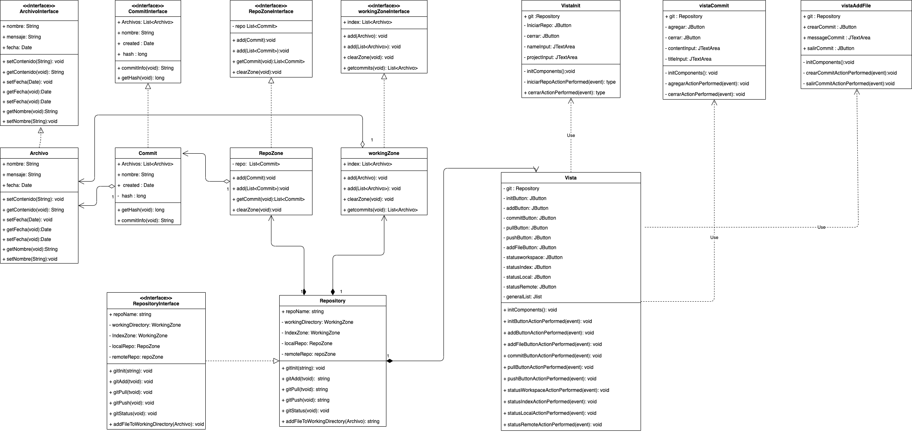

\newpage 

# Indice

1. Introduccion.
2. Descripcion del problema.
3. Descripción del paradigma.
4. Análisis del problema.
5. Diseño de la solución.
6. Aspectos de la implementación.
7. Instrucciones de uso.
7. Resultados y Autoevalución.
8. Conclusiones.
9. Referencias.

\newpage 

# Introducción

Los Paradigmas de programación son modelos o patrones de trabajo, los cuales nos permiten resolver problemas abordando de distintas manera la ejecución de la solución.

Es preciso señalar que indiferente de los lenguajes nuevos, modernos y sus herramnientas propias asociadas, siempre se regirán por al menos uno o más paradigmas de programación. Pues son estos quienes nos permiten analizar de buena manera 

### Objectivo General

Para este laboratorio n°3 se pretende construir una pieza de software que permita simular un "controlador de versiones" tipo git, utilizando como requerimiento base el paradigma orientado a objetos y las caracteristicas que rigen a este paradigma. 

### Objectivos Específicos

Para abordar el problema se plantean lo siguientes objectivos especificos

* Diseño de la solución.
* Aspectos de la implementación.
* Instrucciones de uso.
* Resultados y Autoevalución.
* Conclusiones.

\newpage

# Descripción del problema

La necesidad de mantener y producir software escalable, ordenado y mantenible durante el tiempo es una cuestión importante dentro de la industria. Poder llevar todos los cambios asociados a un proyecto, trabajado por un grupo importante de personas y todo lo que conlleva el manejo de errores es parte de lo que resuelven los software denominados "controladores de versiones".

Para el problema en cuestión se requiere de una pieza de software que permita realizar las siguientes acciones dentro de un directorio de trabajo, independiente del trabajo realizado dentro de este:

* Poder guardar cambios de un proyecto en cuestión, asociados a un espacio de trabajo y a un usuario.

* Poder revisar, listar y mostrar los cambios guardados de un proyecto asociado.

* Poder enviar y traer los cambios que se tienen guardados a un repositorio externo.

* Poder mostrar las zonas y sus diferentes estados dependiendo de la información contenida en estos.

\newpage

# Descripción del paradigma

El "paradigma orientado a objetos" es una paradigma de programación cuya unidad de trabajo son los "objetos", medidas de representación y modelado del mundo real. Estos objetos, pueden relacionarse con otros objetos mediante el uso de mensajes que puedan interpretar.

La definición de un objeto está dada por las "Clases" que son moldes o estructuras definidas para la construcción de objetos semejantes a la clase planteada. Las clases a su vez tienen atributos y metodos. Los atributos son las caracteristicas(variables) que componen a la clase y los metodos(funciones) son los comportamientos definidos para esta misma.

### Caracteristicas definidas del paradigma

Como ya mencionamos, su unidad principal son los "objetos", y la construcción o creación de estos se asocia al concepto de "Clase". Otras caracteristicas importantes a destacar son las siguientes:

* Herencia: Es la capacidad de "heredad" comportamientos y caracteristicas de una clase "padre" a otra "hija", ayudando así a la reutilizacion de codigo y el entendimiento logico.

* Polimorfismo: Esta propiedad relacionada con la herencia, hace referencia al comportamiento de una clase hija, la cual puede comportarse tanto como por su definicion y como por la definición de la clase padre que hereda.

* Sobrecarga: La sobrecarga permite redifinir métodos que experimenten comportamientos distintos dependiendo también de los parametros que son enviados a estos. así podemos tener más de una defincion para el mismo método pero con respuestas distintas.

* Sobreescritura: La sobreescritura se entiene como la redefinición completa de un metodo heredado del padre, para así ajustarlo al comportamiento deseado por la clase hija.

* Clase Abstracta: se entiende por "clase abstracta" la definición de una clase en la que no se puede hacer una instancia directa. Otra definión más entendible es la implementación parcial de un TDA(tipo de dato abstracto), pues permite definir de manera parcial el comportamiento deseado de un representación.

* Interfaces: Las interfaces a su vez son representaciones completas de un TDA, definiciones características y comportamientos ordenados. 

\newpage

# Analisis del problema

Para el problema en cuestion se han dispuesto de distintas zonas de trabajo las cuales consituyen un flujo ordenado y unidireccional. estás zonas corresponden a las siguientes:

* WorkingDirectory: Espacio de trabajo donde agregaremos los archivos que queramos agregar como cambios en nuestro flujo de trabajo principal.
* IndexZone: Espacio de trabajo donde se preparan los archivos que están listos para ser enviados al nuestra rama de trabajo y que cuentan como cambio oficial dentro de nuestro flujo de trabajo mencionado.
* Local Repository: Espacio de trabajo donde se encuentran nuestros cambios locales, no compartidos con el equipo de trabajo en su totalidad.
* Remote Repositoyry: Espacio de trabajo donde se guardan nuestros cambios globales, estos son compartidos en su totalidad por el equipo de trabajo que utiliza el espacio en cuestión.

A su vez se define una unidad llamada "Commit", el commit es una entidad que contiene todos los archivos que asociados a un cambios dentro de nuestro trabajo, junto con un mensaje,meta datos y la información correspondiente a la persona que hizo este cambio. Estos commits solo se encuentran en dos espacios de trabajo los cuales son "Local Repository" y "Remote Repository". 

A su vez se desprende la unidad de "Archivo", el "archivo" es la unidad de minima dentro de un commit y como su nombre lo indica es donde nosotros trabajamos y realizamos cambios en nuestro proyecto en cuestion.

\newpage

# Diseño de solución

Para el diseño en cuestión tenemos el siguiente diagrama UML que muestra la relación entre nuestras clases:

\newpage

Tenemos 5 clases principales que implementan sus interfaces correspondientes para una mayor comprension entre el contrato que tienen con el diseño, estas son :

* Archivo: Clase que representa un archivo de texto plano dentro de la simulación creada.
* Commit : Clase que representa un cambio dentro de nuestro flujo del trabajo dentro de la simulación. Esta Contiene una Lista de Archivos ya actualizados o agregados en la rama de trabajo.
* WorkingZone: Clase que tiene como objetivo representar las dos primeras estaciones de trabajo de la simulación. "WorkingDirectory" e "Index". Estas áreas solo manejan archivos entre sí y representan los estados de trabajo en progreso y teminado en la simulación.
* RepoZone: Clase que tiene como objetivo representar las siguientes dos estaciones de trabajo de la simulación. "Local Respository" y "RemoteRepository". Estas áreas manejan los commits que se guardan como cambios en el flujo de trabajo de un proyecto. 
*Repository : Clase principal que contiene a las otras zonas, permite agregar archivos al "workingDirectory", moverlos al "index", crear commits para el "local Repository" y subir los cambios al "Remote Repository", además de mostrarnos los estados de cada zona en cuestión.

\newpage

# Aspectos de la implementación

Nuestro programa ya creado consta de 6 packages, los cuales son:

* archivo: Contiene la interface de "Archivo" y la definición de clase del mismo.

* commit : Contiene la interace de "Commit" y la definción de clase del mismo.

* repozone: Contiene la interface "RepoZone" y la definición de clase del mismo.

* workingzone: conitene la interface de "WorkingZone" y la definición de clase del mismo.

* repository: Contiene la interface de "Repository" y la definición de clase del mismo.

* main: Contiene nuestra clase principal, la cual implementa "Repository", abre un menu interactivo con numeros y nos permite simular la implementación de la solución descripta.

A su vez todo el codigo fuente se concentra en el directorio "src" dentro del directorio "lab3". Se han ocupado librerías propias del lenguaje para trabajar de mejor manera cada una de las clases ya mencionadas. esta librerías son.

* Date: librería para manejor del tiempo ordenado, utilizado en archivos y commits.

* List: librería para el manejo de listas de cualquier tipo de elemento asociado a estas.

* Instant: libreria utilizada dentro de Commit para crear un hash con respecto al momento en el que este es creado.

* Scanner: utilizado para poder realizar el menú interactivo dentro de la simulación de la implementación y obtener los valores del menu creado.

El proyecto fue creado en un equipo macOS, la que a su vez utilizó como base java version "1.8.0_111". Otros directorios y archivos como "nbproject" y build.xml forman parte del "ide" utilizado en primera instancia para trabajar en este proyecto pero no son requeridos del todo. 

\newpage

# Instrucciones de uso

Para poder ejecutar el codigo de manera correcta se ha dispuesto de un script de bash llamado "script.sh" dentro del directorio raiz del proyecto. este script crea una carpeta llamada "dist" la que a su vez contiene todos los paquetes ya mencionados , compilados en sus respectivos directorios a "byte code". Una vez terminado esto, el proyecto se desplegará en la terminal en la que se ha ejecutado este script.

Al inicializar este desplegará el menu solicitado para el proyecto, el cual acepta solo numeros enteros. cada numero representa una opcion mostrada ya por pantalla. el no seguir estas instrucciones puede llevar al malfuncionamiento o no ejecución de la simulación del todo. 

Para salir de menera correcta del programa, solo se debe ingresar la opcion "0" cuando el menú del programa lo requiera.

\newpage

# Resultados y Autoevaluacion

\newpage

# Conclusiones

\newpage

# Referencias

